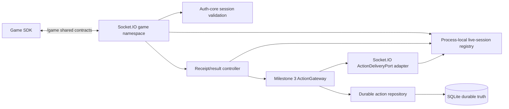

# Phase C Milestone 4 — Architecture Review 01

**Date:** 2026-07-27
**Task:** PHASE-C-MILESTONE-04-ARCHITECTURE
**Branch:** `review/phase-c`
**Baseline:** `a50859f42a5918f0bdd63de0e4cd55531bec4341`
**Claude Architecture Review 01:** REQUEST_CHANGES (historical)
**Remediation 01:** COMPLETE
**Claude Architecture Re-Review 02:** APPROVE_WITH_SMALL_FIX (historical)
**Final Architecture Fix Verification:** APPROVE
**Status:** APPROVED_AND_COMPLETE (ADR-025 through ADR-030 ACCEPTED)

## 1. Context and baseline

Milestone 3 is approved and complete. Milestone 4 connects its
transport-neutral `ActionGateway` and `ActionDeliveryPort` to authenticated
Socket.IO game clients and implements the JavaScript SDK. This document is
architecture only. It adds no runtime dependency or implementation.

Baseline evidence:

```text
branch: review/phase-c
HEAD: a50859f42a5918f0bdd63de0e4cd55531bec4341
working tree before architecture work: clean
Node.js: v24.15.0
pnpm: 11.9.0
```

## 2. Existing architecture assessment

- `apps/server` uses Fastify but has no Socket.IO dependency, namespace,
  connection registry, or transport adapter.
- `@crowdcircuit/auth-core` already supplies ephemeral role sessions,
  validation, revocation, capacity limits, origin authorization, token
  fingerprints, and query-token rejection.
- Pairing returns an opaque game-role token bound to a server-issued
  `clientId`. Sessions die on server restart.
- `ActionDeliveryPort` resolves a destination and sends a
  `PreparedActionDelivery` containing the durable attempt number.
- `ActionGateway` resolves before authorization, commits `send_started` and
  `in_flight`, then calls the port. `no_destination` consumes no attempt.
- Shared contracts already define `game.register`, `game.registered`,
  `game.heartbeat`, `game.action`, `game.action.received`, and
  `game.action.result`.
- The current registration schema incorrectly carries `token` in the
  registration body even though the accepted phase plan requires handshake
  authentication. Delivery, receipt, and result schemas also lack attempt and
  session-generation correlation. These are pre-implementation contract gaps,
  not Milestone 3 lifecycle gaps.
- `@crowdcircuit/game-sdk-js` is only a version placeholder.

## 3. Invariants inherited from Milestone 3

1. Socket.IO never creates, authorizes, attempts, transitions, retries, or
   expires durable actions directly.
2. A send occurs only after destination-bound authorization consumption,
   durable `send_started`, `in_flight`, and transaction commit.
3. Every send and retry resolves a fresh live destination.
4. `nextAttemptAt`, three-attempt maximum, receipt stopping retry, TTL,
   `delivery_unknown_restart`, and terminal results remain authoritative.
5. Reconnect never creates a second action or attempt by itself.
6. Stale runtime owners, sessions, sockets, and connection generations fail
   closed.

## 4. Proposed component diagram



Socket.IO types terminate at `NS`, `REG`, and `ADAPTER`. They do not enter
persistence, mapping, or shared domain repositories.

## 5. Proposed ADRs

ADR-025 through ADR-030 are independently approved and ACCEPTED in `docs/execution/DECISIONS.md`.

- **ADR-025 — `/game` namespace and handshake authentication.**
- **ADR-026 — Live game-session identity, registration, and replacement.**
- **ADR-027 — Socket.IO delivery adapter and connection-generation fencing.**
- **ADR-028 — Attempt-correlated receipt/result protocol and idempotency.**
- **ADR-029 — Game-session liveness, bounds, and security limits.**
- **ADR-030 — SDK enqueue-before-receipt and bounded action deduplication.**

### ADR-025 proposed decision — authentication, wire errors, and observability

| Credential condition | Detection / auth-core code | Stable wire code |
|---|---|---|
| missing or empty handshake token | middleware, before `authorizeSession` | `AUTH_REQUIRED` |
| malformed or wrong token | `INVALID_CREDENTIAL` | `AUTH_INVALID` |
| expired credential | `CREDENTIAL_EXPIRED` | `AUTH_EXPIRED` |
| revoked credential | `CREDENTIAL_REVOKED` | `AUTH_REVOKED` |
| forbidden role or scope | `FORBIDDEN` | `AUTH_FORBIDDEN` |
| any query credential | middleware, before `authorizeSession`; `QUERY_TOKEN_FORBIDDEN` if the auth-core guard is reached | `QUERY_TOKEN_FORBIDDEN` |

Namespace middleware MUST own the two pre-authorization checks shown above.
Origin-policy `FORBIDDEN` maps to `ORIGIN_FORBIDDEN` because origin
authorization is a distinct middleware step. Unsupported roles/scopes MUST map
to `AUTH_FORBIDDEN`, not `AUTH_INVALID`.
- Client-visible errors MUST use stable enumerated wire codes. Internal
  categories MAY be more detailed, but raw `AuthError` messages, raw tokens,
  socket internals, SQL, stack traces, raw payloads, and internal exceptions
  MUST NOT cross the wire.
- Tokens MUST NOT be logged. A short token fingerprint MAY be logged for
  authentication correlation, but MUST NOT be returned to clients or used as
  durable identity.
- Structured diagnostics MUST correlate, when applicable, `actionId`, attempt
  number, authenticated `clientId`, `gameId` (where applicable), `gameInstanceId`,
  session generation, connection generation, server runtime generation, event type,
  and reason/failure code. High-cardinality values MUST remain structured log
  fields and MUST NOT become unbounded metric labels. Process-local session
  counts are operational gauges, not durable action or session truth.

### ADR-027 proposed decision — destination selection and fencing

- Resolution with an explicit non-null `gameInstanceId` MUST select only that
  live instance and MUST NOT fall back to another instance.
- Resolution with null `gameInstanceId` means “any eligible live instance for
  this authenticated action client and game.” Candidates across distinct live
  instances are ordered by `gameInstanceId` ascending. Connection generation
  descending is a defensive secondary ordering key only.
- Under the registry uniqueness invariant, two eligible current entries with
  the same `gameInstanceId` MUST NOT exist. If such a duplicate for the same
  `gameInstanceId` is observed, selection MUST fail closed and emit an internal
  invariant-violation signal rather than silently choosing one. The defensive
  secondary ordering key does not authorize duplicate live sessions.
- This ordering is deterministic routing, not load balancing. The selected
  destination remains runtime- and connection-generation fenced through
  `send`; disappearance or replacement after resolution MUST fail the send.

### ADR-028 proposed decision — cross-generation receipt security

- A receipt for an older durable attempt MAY be accepted only from the current
  valid session generation when the durable attempt is bound to the same
  authenticated client, game, and game instance. A receipt from a stale
  session generation or another client/game instance MUST be rejected.
- This exception tolerates reconnect/replacement without losing a valid
  receipt for an action already locally enqueued. It is safe only because
  `actionId` and attempt identifiers form a high-entropy, unguessable
  correlation tuple; only the client that received the action is assumed to
  possess that tuple; and current authenticated client/game-instance/session
  binding is still checked. Duplicate valid receipts remain idempotent.
- Correlation identifiers MUST NOT be exposed through public telemetry, logs,
  errors, or other clients. Any future exposure, predictable identifier
  generation, shared-instance credential model, weakened identity binding, or
  multi-recipient delivery would invalidate this security assumption and MUST
  trigger revision of ADR-028.
- Results remain stricter: a result MUST satisfy the current-session and exact
  durable action/attempt/client/game-instance bindings. The receipt exception
  MUST NOT weaken result authorization.

## 6. Namespace and event contract

Namespace: `/game`.

Client-to-server events:

- `game.register`
- `game.heartbeat`
- `game.action.received`
- `game.action.result`

Server-to-client events:

- `game.registered`
- `game.action`
- `game.error`

Every event payload is parsed with a strict shared Zod schema before use.
Unknown events are ignored once, counted as `PROTOCOL_UNKNOWN_EVENT`, and
subject to the invalid-message limiter. Invalid known payloads produce
`game.error` and no state mutation.

Required shared-contract corrections:

- Remove `token` from `GameRegisterMessage`; the token exists only at
  `socket.handshake.auth.token`.
- Add `specVersion: "0.1"` to lifecycle control messages.
- Registration retains `gameId`, `instanceId`, and `sdkVersion`.
- `game.registered` returns `clientId`, `gameId`, `gameInstanceId`,
  `sessionGeneration`, `heartbeatIntervalMs`, and server `specVersion`.
- `game.action` adds `attemptNumber` and `sessionGeneration` beside the
  existing envelope.
- Receipt adds `attemptNumber` and `sessionGeneration`.
- Result adds `attemptNumber` and `sessionGeneration`.
- Add strict `GameProtocolErrorMessageSchema` with `type`, `specVersion`,
  enumerated `code`, optional `actionId`, and `retryable`; no secret or raw
  exception text.

Socket.IO callback acknowledgements are not domain acknowledgements. The
protocol uses named messages only. A successful `emit` means the active server
runtime accepted the payload for transport; only
`game.action.received` causes the durable `received` transition.

Contract compatibility is versioned by `specVersion`. Unsupported major or
unknown versions fail registration with `UNSUPPORTED_PROTOCOL`.

## 7. Authentication model

Handshake credentials are exactly:

```text
socket.handshake.auth.token: opaque game-role session token
```

Query-string tokens, cookies, registration-body tokens, and authorization
headers are rejected for `/game`. Authentication runs in namespace middleware:

1. Validate origin against the existing explicit `OriginPolicy`.
2. Require a loopback peer unless a future deployment ADR explicitly enables
   remote access.
3. Reject any query credential.
4. parse `handshake.auth` strictly and enforce a maximum token length of 256.
5. Call `authorizeSession(registry, {token, role:"game"})`.
6. Store only returned `clientId`, expiry, and token fingerprint in socket
   context; never store or log the token.

Authentication is per connection. Registration cannot replace it. The client
may claim `gameId` and `instanceId`, but never `clientId`, role, runtime ID,
session generation, or connection generation. Those are server-derived.

Auth failures use the normative ADR-025 mapping above. Missing-token and query
credential detection occur in middleware before `authorizeSession`; middleware
MUST NOT infer a missing token from generic `INVALID_CREDENTIAL`. Raw auth-core
messages and tokens are not emitted.

## 8. Session identity model

One live destination is identified by:

```text
clientId (from auth session)
+ gameId (validated registration claim)
+ gameInstanceId (nonempty registration instanceId)
+ serverRuntimeGeneration
+ connectionGeneration
```

`socket.id` is metadata, never an authorization identity. Null/anonymous
`gameInstanceId` is forbidden for real Milestone 4 sessions even though the
Milestone 3 port remains nullable for transport-neutral use.

Rules:

- A client may register up to four distinct instances.
- One `(gameId, gameInstanceId)` has exactly one active socket.
- The same authenticated `clientId` reconnecting the same tuple atomically
  replaces the prior socket and increments `connectionGeneration`.
- A different `clientId` attempting the occupied tuple receives
  `INSTANCE_OWNED_BY_OTHER_CLIENT`; no replacement occurs.
- A socket registers once and cannot change identity. A second registration is
  `ALREADY_REGISTERED`.
- Registration must complete within 5000 ms of connection.
- A stale disconnect removes nothing unless its stored generation still equals
  the registry generation.
- `gameId` must resolve to a known manifest/profile association before
  registration succeeds. Active-game switching remains out of scope.

## 9. Live-session registry

The registry is process-local and keyed by canonical
`gameId + "\u0000" + gameInstanceId`. Each entry stores:

- `clientId`, `gameId`, `gameInstanceId`;
- auth fingerprint and auth expiry;
- opaque server runtime generation;
- monotonically increasing connection generation;
- socket handle (private adapter type);
- connected, registered, and last-heartbeat trusted timestamps;
- SDK and protocol versions.

Operations are atomic within the event loop: register/replace, resolve,
validate-current, heartbeat, remove-if-current, and close-all.

Limits:

- 256 active registered sessions per server runtime;
- 4 sessions per `clientId`;
- 1 session per `(gameId, gameInstanceId)`;
- no eviction of a live session to make room; reject with `SESSION_CAPACITY`;
- deterministic cleanup of disconnected/stale entries, at most 128 per sweep.

The registry is not persisted and does not own action truth. Server restart
clears it. Durable pending actions wait for a newly paired and registered
destination; in-flight/received actions follow ADR-021 reconciliation.

## 10. Delivery adapter design

`SocketIoActionDeliveryAdapter` implements the existing
`ActionDeliveryPort`.

`resolveDestination(envelope)`:

1. Select only a registered, authenticated, non-expired, live session matching
   `envelope.gameId`.
2. If `envelope.gameInstanceId` is non-null, require that exact instance.
3. Otherwise invoke ADR-027's null-instance rule: choose an eligible live
   instance for the authenticated action client and game by ordering distinct
   instances by `gameInstanceId` ascending, using connection generation descending
   only as a defensive secondary key. Under registry uniqueness, two eligible entries
   with the same `gameInstanceId` MUST NOT exist; if such a duplicate is observed,
   selection MUST fail closed and emit an internal invariant-violation signal rather
   than silently choosing one. An explicit non-null target never falls back to another
   instance. This is deterministic routing, not load balancing.
4. Return a transport-neutral destination extended during implementation with
   an opaque `destinationGeneration` string/number. Do not return a socket.
5. Return `no_destination` when no eligible entry exists.

`send(delivery)`:

1. Re-read the registry entry.
2. Require client ID, game instance ID, runtime generation, and connection
   generation to match the resolved destination.
3. Require the socket connected, registered, auth-unexpired, and writable.
4. Emit a strict `game.action` message containing the already committed
   `attemptNumber` and current `sessionGeneration`.
5. Return `sent` after synchronous Socket.IO enqueue succeeds.
6. If the destination vanished, was replaced, is backpressured, or emit throws,
   return `transport_error`; do not mutate durable state.

The destination generation is the minimum additive change required to close
the resolve/send race. Socket.IO objects never cross the adapter boundary.

No application-level outbound queue is added. Socket.IO enqueue is the
transport send, not durable receipt.

## 11. Receipt and result protocol

### Receipt

The SDK sends `game.action.received` only after strict envelope validation and
successful insertion into its bounded local execution queue.

Server validation:

1. Payload schema and protocol version pass.
2. Socket is the current registered connection generation.
3. Payload session generation equals the registry entry.
4. Durable action exists and matches registered `gameId`.
5. Durable attempt exists with the supplied attempt number and registered
   `gameInstanceId`.
6. Action is `in_flight`, or already `received/completed/failed`.

For the first valid receipt, call `ActionGateway.markReceived` using the
trusted server clock; client `receivedAt` is diagnostic only. Duplicate valid
receipts return no mutation. A receipt from an older durable attempt is
accepted only under ADR-028's current-generation, authenticated
client/game/instance binding and high-entropy correlation assumptions: it
still proves the action was locally enqueued across replacement. A stale
socket/session generation and a receipt from another client/game instance are
always rejected. Duplicate receipt handling remains idempotent.

### Result

`game.action.result` represents gameplay completion or permanent gameplay
failure, not transport failure. The SDK sends it only after a receipt for the
same action.

Validation repeats the receipt binding checks. The action must be `received`
or already terminal. The server maps `completed`/`failed` to
`ActionGateway.markResult`. Duplicate identical terminal results are
idempotent. A conflicting second terminal result returns
`RESULT_CONFLICT` and never rewrites durable truth.

Late results after `expired`, `delivery_failed`,
`delivery_unknown_restart`, or `aborted_restart` return
`ACTION_NOT_ACCEPTING_RESULT`; no resurrection occurs. Result `details` and
error fields remain JSON-safe and size bounded.

There is no wire-level “execution started” event in Milestone 4. It is an SDK
internal state; adding one would not change retry because receipt already
stops delivery retry.

## 12. Reconnect and stale-session semantics

Replacement sequence:

1. New socket authenticates with a currently valid token.
2. It registers the same tuple.
3. Registry atomically publishes generation `N+1`.
4. Old socket receives `SESSION_REPLACED` and is disconnected.
5. Old socket events and disconnect callbacks carry generation `N`; all fail
   `validate-current` and cannot remove or mutate generation `N+1`.
6. Future delivery resolves generation `N+1`.

There is no reconnect grace lease. Registry removal is immediate and fenced.
Durable `no_destination` rechecks provide the bounded wait behavior.

SDK action deduplication survives reconnect within the same SDK object. A page
reload creates a new SDK cache; durable action IDs and repeat receipt semantics
still prevent server-side duplicate lifecycle mutation, while gameplay
exactly-once across a full client-state loss is not claimed.

## 13. Liveness, disconnect, and restart

- Socket.IO ping interval: 10 seconds.
- Socket.IO ping timeout: 20 seconds.
- SDK `game.heartbeat`: every 10 seconds after registration.
- Session stale threshold: 30 seconds since last valid heartbeat.
- Liveness sweep: every 5 seconds, at most 128 entries.
- Registration deadline: 5 seconds.

Socket.IO ping/pong detects broken transport; the custom heartbeat proves the
SDK event loop and registered protocol handler are alive. Missing the stale
threshold removes-if-current and disconnects the socket. Delivery during
reconnect returns `no_destination` or a fenced `transport_error`.

On graceful server shutdown: stop accepting connections, fence/close the
registry, disconnect namespace sockets, stop timers, then dispose auth. No
background task survives shutdown.

On restart: auth sessions and registry are empty, so clients must pair again.
Milestone 3 reconciliation remains authoritative; no old gameplay is replayed
automatically.

## 14. Backpressure and limits

- Socket.IO `maxHttpBufferSize`: 65,536 bytes.
- Registration: one accepted attempt per socket; at most 4 invalid attempts
  before disconnect.
- Heartbeat limiter: 2/second, burst 4 per socket.
- Receipt/result limiter: 20/second, burst 40 per socket.
- Invalid/unknown messages: 5 within 10 seconds, then disconnect.
- SDK execution concurrency: 32 handlers.
- SDK pending local action queue: 256 entries.
- SDK dedupe/result cache: 2048 action IDs, terminal entries retained for
  30 minutes, then deterministic LRU expiry.
- No unbounded server or SDK queue.

When the SDK queue is full it does not emit receipt; it may emit a protocol
error diagnostic, and the durable retry/TTL policy remains in control. Active
SDK entries are never evicted. If all 2048 entries are active, the SDK rejects
new enqueue without receipt.

## 15. Security model

- Namespace middleware authenticates before registration handlers run.
- Explicit origins only; wildcard credentialed CORS is forbidden.
- Default listener remains loopback. Remote exposure requires TLS termination
  and a future deployment decision; Milestone 4 does not enable it.
- Token appears only in handshake auth, is never echoed, persisted, included
  in URLs, or logged. Logs may contain only its short fingerprint.
- Client ID and role are server-derived from auth.
- Every receipt/result is checked against current socket generation, registry
  identity, durable action game, durable attempt number, and bound instance.
- Zod strict parsing and the 64 KiB transport limit precede business logic.
- Rate/capacity exhaustion fails closed and never evicts an authorized live
  session or mutates durable state.

## 16. Error taxonomy

Connection errors:

- `AUTH_REQUIRED`, `AUTH_INVALID`, `AUTH_EXPIRED`, `AUTH_REVOKED`
- `AUTH_FORBIDDEN`, `QUERY_TOKEN_FORBIDDEN`, `ORIGIN_FORBIDDEN`

Registration errors:

- `REGISTRATION_REQUIRED`, `REGISTRATION_TIMEOUT`, `INVALID_REGISTRATION`
- `UNSUPPORTED_PROTOCOL`, `UNSUPPORTED_SDK`, `GAME_NOT_FOUND`
- `ALREADY_REGISTERED`, `INSTANCE_OWNED_BY_OTHER_CLIENT`, `SESSION_CAPACITY`

Message/lifecycle errors:

- `INVALID_MESSAGE`, `RATE_LIMITED`, `SESSION_STALE`, `SESSION_REPLACED`
- `ACTION_NOT_FOUND`, `ACTION_BINDING_MISMATCH`, `ATTEMPT_NOT_FOUND`
- `ACTION_NOT_ACCEPTING_RECEIPT`, `ACTION_NOT_ACCEPTING_RESULT`
- `RESULT_CONFLICT`, `INTERNAL_ERROR`

Errors contain code, retryable, optional action ID, and correlation ID. They
never expose tokens, socket internals, SQL, stack traces, or raw payloads.

## 17. Observability

Structured events record:

- connection/auth success or failure by code and token fingerprint;
- registration/replacement/disconnect with client, game, instance, and
  generations;
- destination resolve outcome;
- transport enqueue outcome and durable action/attempt number;
- receipt/result accepted, duplicate, rejected, or conflicting;
- heartbeat expiry, rate limit, and capacity rejection.

Counters are bounded aggregate metrics. Payload bodies, action params, tokens,
and raw errors are not logged. Correlation uses action ID, attempt number, event type,
reason/failure code, and server-generated connection correlation ID.

## 18. Important sequences

### Connection and registration

```text
client connects /game with handshake auth token
→ origin/query/auth middleware validates
→ unregistered socket starts 5s deadline
→ game.register schema validates game/instance/versions
→ manifest association validates
→ registry register/replace publishes generation
→ game.registered returns authoritative identity and heartbeat interval
```

### First send, receipt, and result

```text
ActionGateway resolves fresh destination generation
→ durable authorization + send_started + in_flight commit
→ adapter revalidates same generation and emits game.action
→ SDK validates and enqueues locally
→ SDK emits attempt-correlated receipt
→ server validates session/action/attempt and marks received
→ handler completes or fails
→ SDK emits result
→ server validates and marks completed/failed
```

### Retry and disconnect

```text
no receipt by durable nextAttemptAt
→ gateway resolves current registry entry again
→ fresh destination-bound authorization and durable attempt commit
→ adapter revalidates generation and emits
disconnect/replacement at any point
→ remove-if-current; stale generation callbacks no-op
→ no destination consumes no attempt; TTL and max attempts remain authoritative
```

### Server restart

```text
registry/auth sessions disappear
→ durable repository reconciles previous runtime
→ clients must pair and register again
→ pending work may use new destination
→ in-flight becomes delivery_unknown_restart; received remains received
→ no automatic prior-runtime gameplay replay
```

## 19. Test strategy and acceptance matrix

Every row is a Milestone 4 acceptance obligation; none MAY be omitted because
another row provides surrounding coverage.

| Required category | Required style | Failure property that MUST be proved |
|---|---|---|
| duplicate registration | real Socket.IO integration + registry unit | A socket cannot change identity or create a second registration; it receives `ALREADY_REGISTERED` with no registry mutation. |
| duplicate receipt idempotency | repository integration + real Socket.IO integration | Repeating the same valid receipt causes at most one durable transition and does not corrupt retry state. |
| duplicate result idempotency | repository integration + real Socket.IO integration | Repeating an identical terminal result performs no second mutation, while a conflicting result is rejected. |
| stale-attempt receipt | repository integration + adapter integration | An older attempt receipt is accepted only under ADR-028's current-generation and exact identity binding. |
| stale-attempt result | repository integration | A result with a non-authorized attempt cannot mutate durable truth; result authorization remains stricter than receipt tolerance. |
| cross-client spoof rejection | multi-client race/concurrency + real Socket.IO integration | A client or game instance that did not receive the bound attempt cannot acknowledge or complete it. |
| multiple game instances per client | real Socket.IO integration + registry unit | Up to the configured per-client bound remain independently addressable and explicit instance routing never falls back. |
| capacity exhaustion | registry unit + real Socket.IO integration | Global, per-client, and per-instance limits fail closed without eviction or partial registration. |
| registration-rate exhaustion | fake-clock + real Socket.IO integration | Excess registration attempts are rejected/disconnected at the exact configured boundary without registry mutation. |
| invalid-message-rate exhaustion | fake-clock + real Socket.IO integration | Malformed/unknown-message limits disconnect at the exact boundary and do not mutate action state. |
| receipt/result-rate exhaustion | fake-clock + real Socket.IO integration | Excess lifecycle messages are rate-limited before durable mutation. |
| malformed payloads | real Socket.IO integration + adapter unit/integration | Strict schemas reject missing, extra, wrong-type, and unsupported-version fields before business logic. |
| oversized payloads | real Socket.IO integration | Payloads above `maxHttpBufferSize` are rejected by transport and never reach durable mutation. |
| destination disappears after resolve | adapter unit/integration + multi-client race/concurrency | Send revalidation returns `transport_error` and emits nothing when the resolved entry is removed. |
| destination is replaced after resolve | adapter unit/integration + multi-client race/concurrency | The old generation cannot receive the action and the adapter does not silently retarget the send. |
| real Socket.IO server/client integration | real Socket.IO integration | Handshake auth, origin/query rejection, registration, namespace isolation, replacement, delivery, receipt/result, heartbeat, reconnect, and shutdown work through the actual server/client stack. |
| pure registry unit tests | registry unit | Register, replace, resolve, validate-current, heartbeat, remove-if-current, ordering, bounds, and cleanup obey generation fencing without Socket.IO. |
| adapter tests | adapter unit/integration | Resolution ordering, send revalidation, backpressure, disappearance, replacement, and emit failure never mutate persistence. |
| fake-clock tests | fake-clock | Registration deadlines, heartbeat expiry, rate windows, cleanup, retry/TTL interaction, and SDK cache expiry are exact and contain no wall-clock dependence. |
| repository integration tests | repository integration with real SQLite | Commit precedes observed delivery; receipt stops retry; idempotency, TTL, and restart reconciliation preserve Milestone 3 truth. |
| race/concurrency tests | multi-client race/concurrency | Simultaneous registration/replacement, disconnect, spoof attempts, and resolve/send changes have one deterministic fenced outcome. |
| public contracts | declaration/public-contract | Shared schemas and server/SDK package-root APIs accept valid correlation fields and reject invalid versions, identities, codes, and handler signatures without leaking Socket.IO types. |

SDK fake-socket tests MUST additionally prove enqueue-before-receipt, handler
concurrency, duplicate delivery without duplicate gameplay, repeated receipt,
cached result, bounded queues/caches, reconnect listener cleanup, and disposal.
Node worker threads remain required only for persistence races inherited from
Milestone 3; process-local registry concurrency uses independent real clients.

## 20. Public API and export boundary

- `@crowdcircuit/contracts`: lifecycle message schemas/types only; no Socket.IO
  types.
- `@crowdcircuit/auth-core`: existing generic session/origin APIs; change only
  if an independently reviewed narrow adapter helper is proven necessary.
- `@crowdcircuit/server`: composition options and intentionally testable
  transport/session ports; no raw namespace/socket types in package-root
  declarations.
- `@crowdcircuit/game-sdk-js`: `CrowdCircuitGameClient`, configuration,
  registration/connect/disconnect, action handler registration, receipt/result
  reporting, and disposal. Provider/socket internals stay private.

## 21. Migration and persistence impact

No migration or schema change is expected. Session registry state is
deliberately process-local. Durable attempt history already contains action ID,
attempt number, runtime ID, and game instance binding. If implementation proves
that cross-client validation cannot be performed from these existing fields,
stop with `ARCHITECTURE_GAP`; do not add a convenience migration silently.

## 22. Alternatives considered

- Token in `game.register`: rejected because handlers would exist before
  authentication and it conflicts with the accepted handshake-auth plan.
- Query token: rejected due to URL/log leakage.
- Multiple sockets per instance: rejected because destination choice and stale
  receipt authorization become ambiguous.
- Durable session registry: rejected because auth/session state is ephemeral
  and it would become a second source of truth.
- Socket.IO callback as receipt: rejected because server enqueue is not client
  local enqueue.
- Grace-period registry entries: rejected because fenced immediate replacement
  plus durable no-destination retry is simpler and deterministic.
- Unbounded outbound buffering: rejected because it bypasses backpressure and
  TTL authority.

## 23. Risks and mitigations

- Resolve/send race: destination generation is revalidated immediately before
  emit.
- Old disconnect deletes replacement: remove-if-current generation guard.
- Cross-client spoof: auth-derived client plus registry and durable attempt
  binding checks.
- Client reload loses dedupe cache: at-least-once semantics are explicit;
  durable server idempotency remains intact.
- SDK queue exhaustion: bounded queue, no premature receipt.
- Contract drift: shared Zod schema slice precedes transport implementation.
- Timer leakage: one owned lifecycle controller with explicit shutdown.

## 24. Open questions

No product-blocking question remains. Independent review must confirm:

1. The proposed breaking pre-implementation removal of `token` from
   `GameRegisterMessage`.
2. Addition of attempt/session-generation fields to lifecycle messages.
3. The selected numeric bounds and heartbeat timing.

Any requested change to these items returns to architecture review before
implementation.

## 25. Final architecture verdict

**APPROVED_AND_COMPLETE** (Final Verdict: APPROVE; ADR-025 through ADR-030 ACCEPTED)

The current repository can implement this design without weakening Milestone
3, adding durable session state, or making a hidden product decision.
